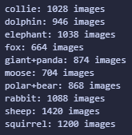
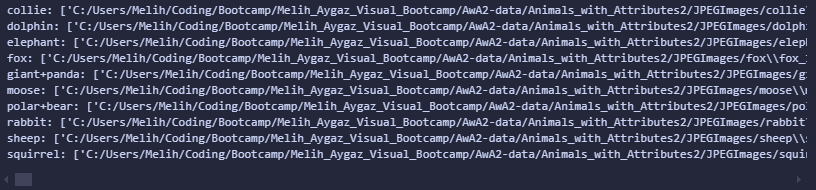
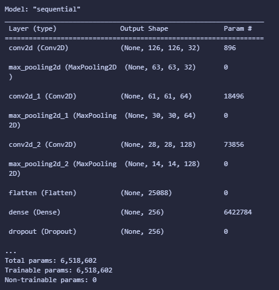
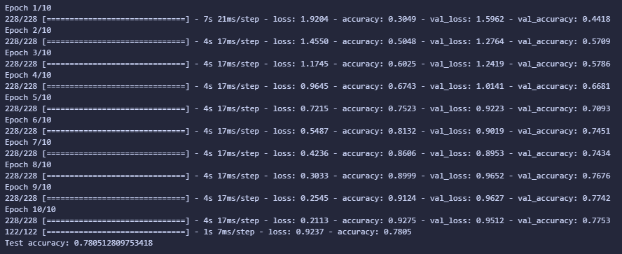
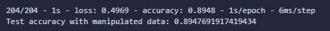
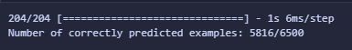
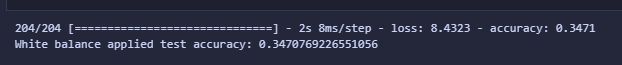

# Melih_Aygaz_Image_Processing_Bootcamp

## This repository is an example of Image Processing Bootcamp.

## Personal Note:
To be honest, this project was my first image processing project. Feel free to open issues and pull requests to help improve it. Special thanks to Global AI Hub for organizing this bootcamp—I learned a lot through this project.

Now, let me tell you more about my work. As you can see, there are multiple .ipynb files in the repository. I uploaded them to compare the accuracy differences.

### Libraries

- os
  - used for saving/reading processed, manipulated, and augmented images
- cv2
  - used for reading and manipulating photos
- numpy
  - used for array operations, for example creating color constancy function, concatenation and others
- matplotlib
  - used for showing examples of correct and incorrect predicted of images
- sklearn
  - used for creating test and train data from images
- tensorflow.keras
  - used for creating model, and data augmentation

---

### Image_Processing_Bootcamp_Final_Editon Cells

- 1st Cell: Imported libraries
- 2nd Cell: I initialized image directory as `base_path`. Then I created an array for animal classes that I need. I created a nested for loop for searching animals using `os` library. After that I create a for loop to show how many image that datase has.

- 
- 3rd Cell: Used for loop to show directories
  
- 4th Cell: First 650 images are resized, normalized and saved to `processed_images` path.
- 5th Cell: In this cell I created `load_images` and `manipulate_images` function. For manipulating images, I adjusted brightness, contrast, and white balance.
- 6th Cell: Created a save function that i manipulated images above the cell.
- 7th Cell: I used `load_images` function to loading processed and manipulated images. Then I concatenated them with using `numpy` library. So i can train my model with combined datasets.
- 8th Cell: I split my train and test data. After that I create my model with different layers. Then I compiled my model.
- 
- 9th Cell: At this cell I use `ImageDataGenerator` function from `tensorflow.keras` library. With that function I made augmentation. Then I applied to the train dataset.
- 10th Cell: Now, finally I can train my model and see accuracy points. Which is 78%
- 
- 11th Cell: I created only manipulated dataset for testing my model.
- 12th Cell: With manipulated dataset, my model's accuracy is 89% which is great. But this wasn't always like that high.
- 
- 13th Cell: I made an operation and then I see how many predictions are correct.
- 
- 14th Cell: I want to see which images are incorrect predicted. Randomly chosen 5 picture is shown at this cell's output which their real and predicted animal classes.
- 15th Cell: Same thing but with correct predicts.
- 16th Cell: I created an color constancy algorithm with `get_wb_images` function. Which uses `numpy` library to make array operations like mean, sum, and normalize.
- 17th Cell: Applied color constancy algorithm to the manipulated images, and saved them.
- 18th Cell: Loading color constanced images
- 19th Cell: Normalize and test accuracy point for color constanced images which is 34%
- 

---

## From now on I will only tell differences between other files and why i keep them.
First, I started my project with the bootcamp.ipynb file. I initially tried using Google Colab, but it took over 50 minutes just to train the model. After that, I decided to work on my own computer. As you can see, training only takes 82 seconds to finish now. It felt like a fairytale until my VRAM and RAM were completely filled. I searched for solutions, but none of them worked for me, including using the gc.collect() function.

The bootcamp.ipynb file served as my base file, and in that file, the results were as follows:

    Training and test accuracy for processed images: 78%
    Test accuracy for manipulated images: 9%
    Test accuracy for white balance (color constancy) applied images: 10%

Next, I changed the parameters in the model. The base file had layers.Dense(128, activation='relu') as a parameter for the model. I increased it to layers.Dense(256, activation='relu'). The results were:

    Training and test accuracy for processed images: 84%
    Test accuracy for manipulated images: 11%
    Test accuracy for white balance (color constancy) applied images: 9%

After that, I increased it further to layers.Dense(512, activation='relu'), but this time, the results were:

    Training and test accuracy for processed images: 75%
    Test accuracy for manipulated images: 12%
    Test accuracy for white balance (color constancy) applied images: 10%

It became clear that the optimum value for this model was layers.Dense(256, activation='relu'). Then I thought, What happens if I train my model with both processed and manipulated images? This time, the results were:

    Training and test accuracy for processed images: 78%
    Test accuracy for manipulated images: 89%
    Test accuracy for white balance (color constancy) applied images: 11%

That still wasn’t enough for me, and I didn’t want to overfit my model. So, I started browsing and asking AI about how to improve color constancy. I found that I should use data augmentation methods. Using the ImageDataGenerator function from the tensorflow.keras library, I added properties to the dataset. Finally, the results were:

    Training and test accuracy for processed images: 78%
    Test accuracy for manipulated images: 89%
    Test accuracy for white balance (color constancy) applied images: 34%

Still, the color constancy test accuracy is not sufficient, but I don’t have enough time to improve it further before the deadline.
